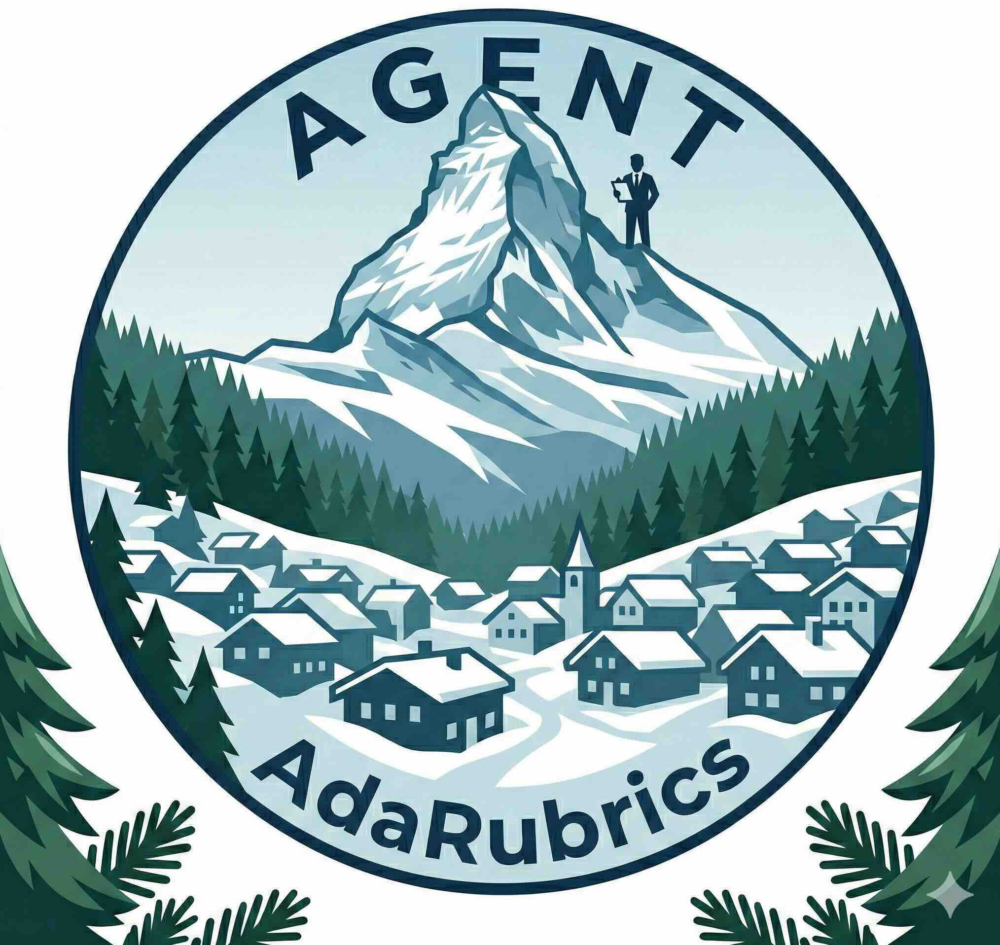

# AdaRubric

<p align="center">
  <a href="https://github.com/alphadl/AdaRubrics/actions/workflows/ci.yml">
    
  </a>
  
  <a href="LICENSE">
    
  </a>
</p>

<p align="center">
  
</p>

<p align="center">
  <em>Task-adaptive rubrics and dense reward signals for LLM agent trajectory evaluation</em>
</p>

<p align="center">
  <a href="#paper">📄 Paper</a> •
  <a href="#core-idea">Core Idea</a> •
  <a href="#installation">Installation</a> •
  <a href="#quick-start">Quick Start</a> •
  <a href="#architecture">Architecture</a> •
  <a href="#related-projects">Related projects</a> •
  <a href="#citation">Citation</a>
</p>

---

## Paper

**AdaRubric: Task-Adaptive Rubrics for LLM Agent Evaluation**

📄 **[Read the paper (PDF)](assets/adarubrics.pdf)**

> LLM-as-Judge evaluation fails on agent tasks because a fixed rubric cannot capture what matters for *this* task: code debugging demands *Correctness* and *Error Handling*; web navigation demands *Goal Alignment* and *Action Efficiency*. AdaRubric generates task-specific rubrics on the fly, scores trajectories step-by-step with confidence-weighted per-dimension feedback, and filters preference pairs with the novel **DimensionAwareFilter** — a provably necessary condition for preventing high-scoring dimensions from masking dimension-level failures.

### Key Results

| Metric | Value |
|---|---|
| Human correlation (Pearson *r*) | **0.79** (+0.16 over best static baseline) |
| Inter-run reliability (Krippendorff's α) | **0.83** (deployment-grade) |
| DPO task success gain over Prometheus | **+6.8–+8.5 pp** across WebArena / ToolBench / AgentBench |
| Transfer to SWE-bench code repair | **+4.9 pp** resolve rate (zero rubric engineering) |
| PPO convergence acceleration | **+6.6 pp** SR at 5K steps |

---

## Core Idea

Standard LLM evaluation applies **static** dimensions (Helpfulness, Fluency, Safety) regardless of task type. For goal-directed agent tasks — multi-step tool calls, API orchestration, code repair — a static rubric systematically mis-measures quality.

**AdaRubric** addresses this with a three-stage pipeline:

```
TaskDescription
      │
      ▼
┌─────────────┐     ┌────────────────────┐     ┌──────────────────┐
│   Stage 1   │     │     Stage 2        │     │     Stage 3      │
│   Rubric    │────▶│   Trajectory       │────▶│      Data        │
│  Generator  │     │   Evaluator        │     │     Filter       │
│  (LLM→R(T)) │     │ (per-step×per-dim) │     │ (DimAwareFilter) │
└─────────────┘     └────────────────────┘     └──────────────────┘
      │                     │                          │
 DynamicRubric       {s_{k,j}, c_{k,j}}          DPO Pairs
 (N dimensions)    (score + confidence)      (margin-gated)
```

1. **Rubric Generator** — Given a task description, an LLM generates *N* orthogonal evaluation dimensions with calibrated 5-point scoring criteria. Rubrics are cached per task type (>95% API cost reduction).
2. **Trajectory Evaluator** — Each (Thought → Action → Observation) step is scored per-dimension with a confidence weight `c_{k,j} ∈ [0,1]`. Three pluggable aggregators: **Weighted Mean** (default), **Geometric Mean**, **Min Score**.
3. **Data Filter** — Four composable filters curate high-quality DPO preference pairs. The key innovation is **DimensionAwareFilter**: a trajectory with a perfect average score can still fail catastrophically on a single dimension — DAFilter provably prevents this.

---

## Installation

```bash
git clone https://github.com/alphadl/AdaRubrics.git
cd AdaRubrics
pip install -e ".[dev]"
```

Set `OPENAI_API_KEY` in your environment (or pass via config). YAML config support requires `pip install pyyaml`.

---

## Quick Start

```python
import asyncio
from adarubric import AdaRubricPipeline, TaskDescription, Trajectory, TrajectoryStep
from adarubric.config import AdaRubricConfig

task = TaskDescription(
    task_id="demo-001",
    instruction=(
        "Use the weather API to check if it will rain in Tokyo tomorrow, "
        "and if so, suggest indoor activities."
    ),
    domain="Personal Assistant",
    expected_tools=["weather_api", "activity_search"],
)

trajectory = Trajectory(
    trajectory_id="traj-demo-001",
    task_id="demo-001",
    steps=[
        TrajectoryStep(
            step_id=0,
            thought="I need to check tomorrow's weather in Tokyo first.",
            action="weather_api",
            action_input={"city": "Tokyo", "date": "tomorrow"},
            observation="Tomorrow: 70% chance of rain, high 18°C, low 12°C.",
        ),
        TrajectoryStep(
            step_id=1,
            thought="It's likely to rain. Let me find indoor activities.",
            action="activity_search",
            action_input={"city": "Tokyo", "type": "indoor", "limit": 5},
            observation="1. TeamLab Borderless, 2. Tokyo National Museum, 3. Akihabara arcades...",
        ),
    ],
)

pipeline = AdaRubricPipeline.from_config(AdaRubricConfig())
result = asyncio.run(pipeline.run(task, [trajectory], num_dimensions=4))

print(f"Rubric dimensions: {result.rubric.dimension_names}")
print(f"Global score:      {result.mean_score:.2f}/5.0")
print(f"Survival rate:     {result.survival_rate:.0%}")
```

Run the full example:

```bash
export OPENAI_API_KEY="sk-..."
python examples/quickstart.py
```

---

## Architecture

### Aggregation Strategies

| Strategy | Behavior | Use Case |
|---|---|---|
| `WeightedMeanAggregator` | Confidence-weighted mean with optional recency decay (λ) | Default — balanced evaluation |
| `GeometricMeanAggregator` | Geometric mean — penalises low outliers | Tasks requiring balanced per-step performance |
| `MinScoreAggregator` | Global score = worst dimension | Safety-critical evaluations |

### Filter Strategies

| Filter | Behavior |
|---|---|
| `AbsoluteThresholdFilter` | Fixed overall score cutoff |
| `PercentileFilter` | Keep top-*k*% of batch |
| `DimensionAwareFilter` | Per-dimension minimums — blocks quality masking |
| `CompositeFilter` | Logical AND of multiple filters |

### Project Structure

```
adarubric/
├── core/           # Data models, exceptions, types
├── llm/            # LLM client abstraction (OpenAI, vLLM)
├── generator/      # Dynamic rubric generation + prompts
├── evaluator/      # Trajectory evaluation + aggregation
├── filter/         # Composable filtering strategies
├── analysis/       # Reliability (Krippendorff's α) and consistency
├── io/             # Trajectory/evaluation serialization, DPO export
├── reward/         # Score scalers, step reward assignment, DPO pair generation
├── pipeline.py     # End-to-end orchestration
└── config.py       # Layered configuration
```

---

## Testing

```bash
pytest tests/ -v
```

---

## Related Projects

- **[AgentHER](https://github.com/alphadl/AgentHER)** — Hindsight Experience Replay for LLM agents: relabels failed trajectories into valid training data (SFT/DPO). Pairs naturally with AdaRubric — use AdaRubric to score relabelled trajectories and filter by quality before training.
- **[AgentSynth](https://github.com/alphadl/AgentSynth)** — Synthetic agent data pipeline (forward + back-translation, execution-based reject sampling). Score and filter synthesized trajectories with AdaRubric before training.
- **[trajectory_tokenization](https://github.com/alphadl/trajectory_tokenization)** — ReAct with trajectory tokenization: compresses long (Thought, Action, Observation) histories for long-horizon tasks. Addresses context length; AdaRubric addresses trajectory *quality*.

---

## Citation

If you find AdaRubric useful, please cite:

```bibtex
@article{ding2025adarubric,
  title     = {AdaRubric: Task-Adaptive Rubrics for LLM Agent Evaluation},
  author    = {Liang Ding},
  year      = {2025},
  url       = {https://github.com/alphadl/AdaRubrics}
}
```

---

## License

Apache 2.0
